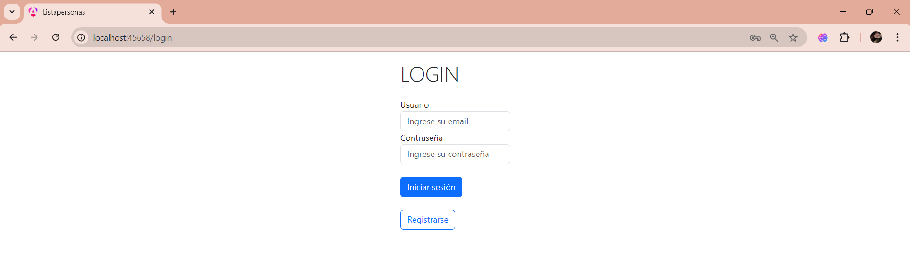
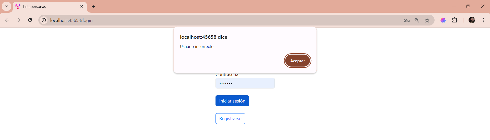
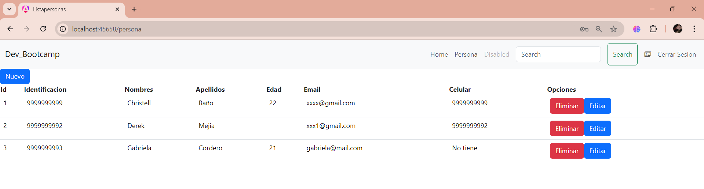
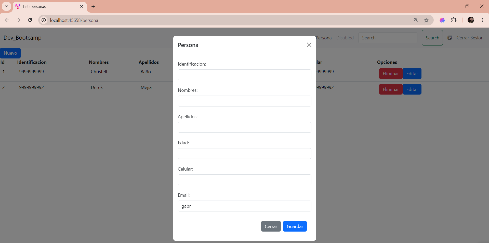

# Deber N2

## Requerimientos:

REALIZAR UN SISTEMA DE MANEJO DE UNA LISTA DE PERSONAS:
```
UNA PERSONA TIENE LOS SIGUIENTES DATOS:
 * IDENTIFICACIÓN
 * NOMBRES
 * APELLIDOS
 * EDAD
 * EMAIL
 * CELULAR(OPCIONAL)

EL SISTEMA CUENTA CON UN MÓDULO DE INICIO DE SESIÓN CON LOS VALORES POR DEFECTO DE vmtdev@mail.com - 123456. - Dev Bootcamp
ADEMÁS, EL SISTEMA DEBE MOSTRAR EN EL HEADER EL NOMBRE DE USUARIO CUANDO SE HAYA INICIADO SESIÓN.
```

CONSIDERACIONES:
```
* USAR ALERTA DE BOOTSTRAP O TOAST PARA MENSAJES DE ERROR O ÉXITO.
* USAR MÓDULOS PARA LAS RUTAS
* LOS DATOS POR DEFECTO SOLO DEBEN PODER AGREGAR MÁS PERSONAS
* SI NO REGISTRA CELULAR MOSTRAR EL LABEL(NO TIENE)
```

## INTEGRANTES: 
* Derek Mejía
* Christell Baño

## PARA INGRESAR CON USUARIO DEFAULT UTILIZAR LAS SIGUIENTES CREDENCIALES:
* Email: vmtdev@mail.com
* Password: 123456.

## Explicación del código

### Página Login 
- **Descripción:** 
Permite al usuario ingresar al sitio con las debidas credenciales de acceso, que se detallaron con antelación. 



En caso de que los datos no sean los correctos, se muestran mensajes de error tanto para:

> "Usuario Incorrecto:



> "Contraseña Incorrecta:


### Encabezado del proyecto
- **Descripción:** 
Una vez se haya iniciado sesión, el encabezado nos sirve como un punto de acceso para navegar a la sección principal del proyecto: "Personas" o estar en la página inicial "Home".
En otras palabras, la navegación está asegurada mediante enlaces ubicados en el encabezado de la página que a su vez, nos brinda la opción de "Cerrar Sesión", opción que redirecciona a la página Login. 





### Página Personas
- **Descripción:** 
Permite al usuario ingresar nuevas personas en el listado, que quedan almacenadas con las dos personas principales, que fueron detalladas en el array dentro del código (app>DataSource>lpersona.ts).
Se tiene la opción de editar los datos que se almacenan y de eliminar a cualquier persona que este almacenada en la tabla. 

Para el ingreso de nuevos datos, se desarrolló un modal.

Se implementó un pipe (app>Modulo>telefono.pipe.ts), que nos sirve para en caso de que el dato "celular" no sea ingresado, la celda correspondiente no quedé vacía y muestre lo siguiente: "No tiene". 




## FIN
